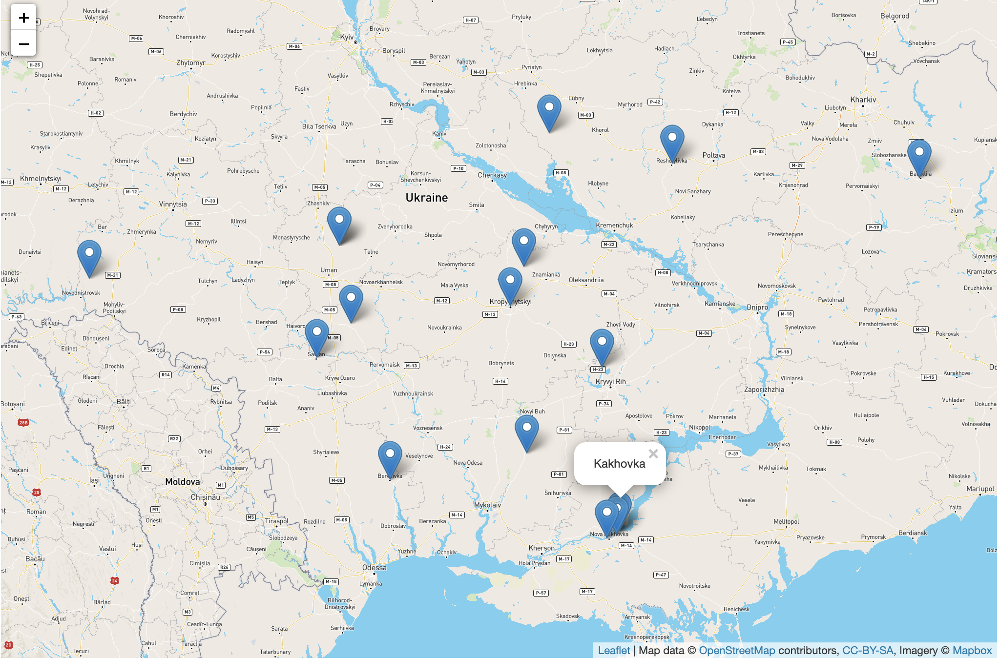

# KD-Tree Demo
This repository demonstrates how to use KDTree implementation in PHP

## Start

To start, you should have [docker-compose](https://docs.docker.com/compose/ "docker-compose") installed, just simply type next command in root dir:
```bash
docker-compose up -d
```

## Usage
After you ran project, just open one of the next pages and click on the map:
+ [Naive implementation address](http://localhost:8080/naive "Naive implementation address")
+ [KDTree implementation address](http://localhost:8080/kd "Naive implementation address")



## Benchmarks
Naive implementation:


KDTree implementation:


As you can see results are amazing!

## Materials used:
+ [KDTree in PHP](https://github.com/f1r3starter/kdtree "KDTree in PHP")
+ [cities.json](https://github.com/lutangar/cities.json "cities.json")
+ [react/http](https://github.com/reactphp/http "react/http")
